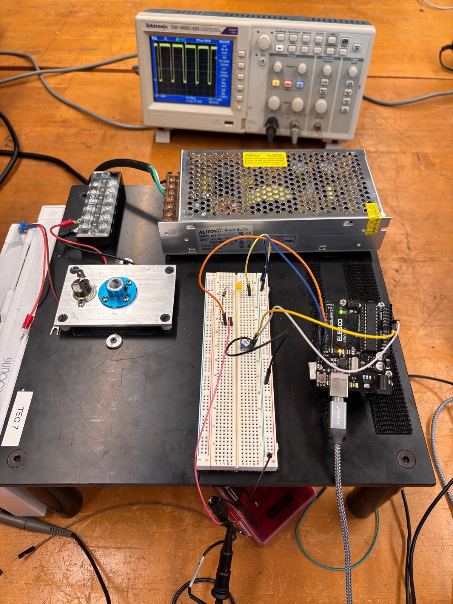
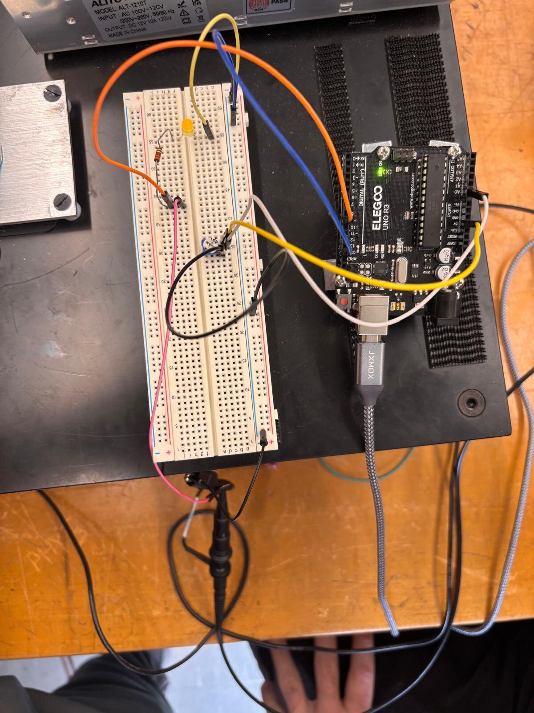
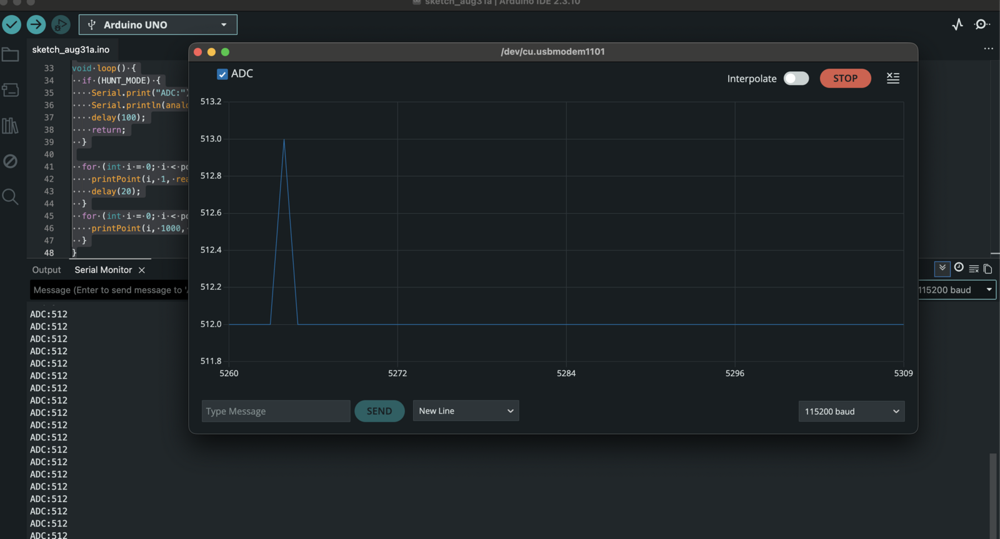
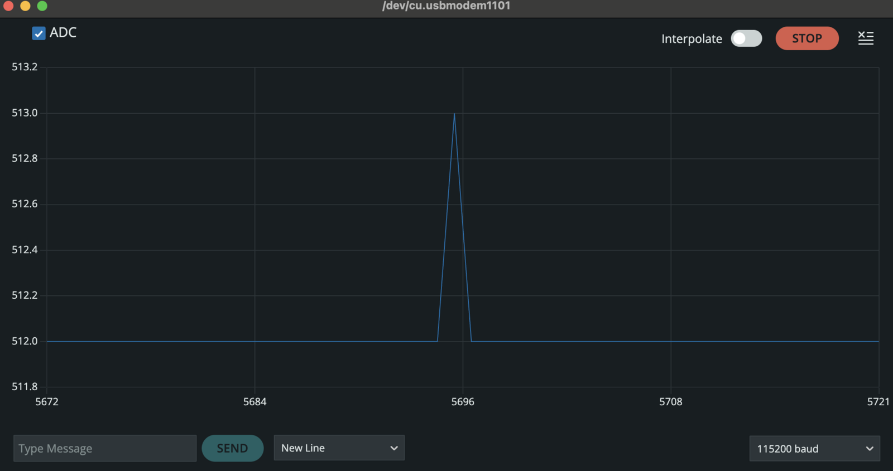
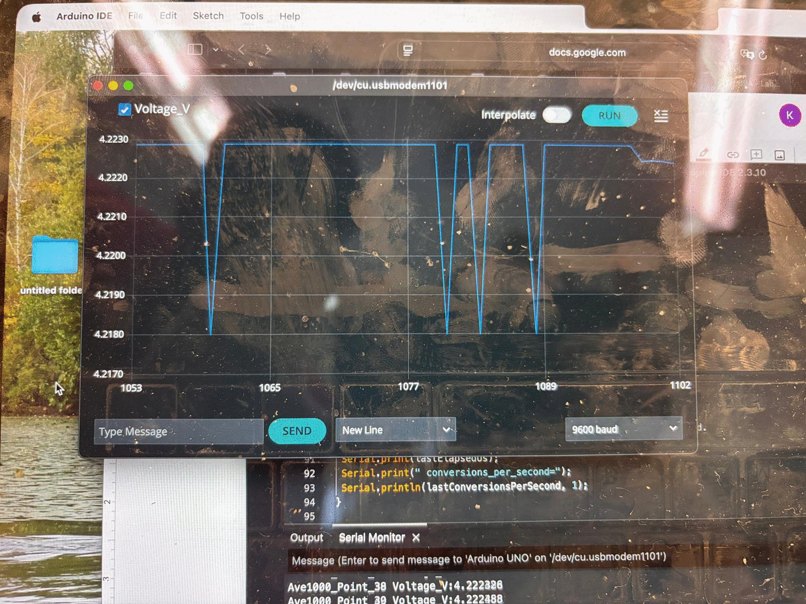
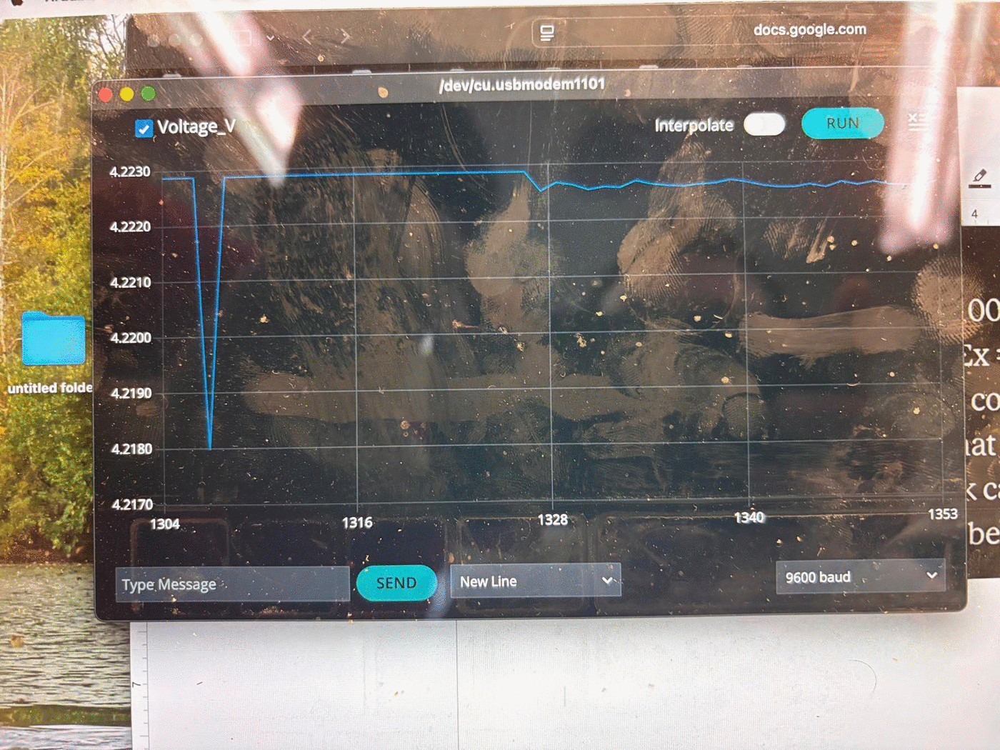
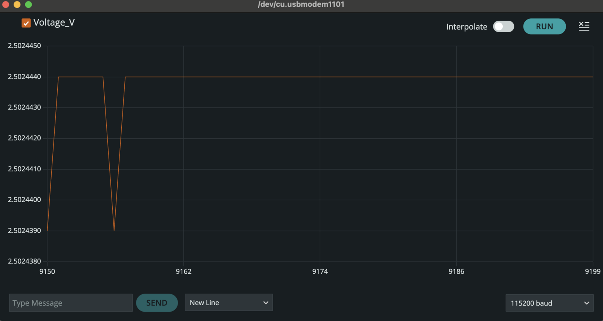
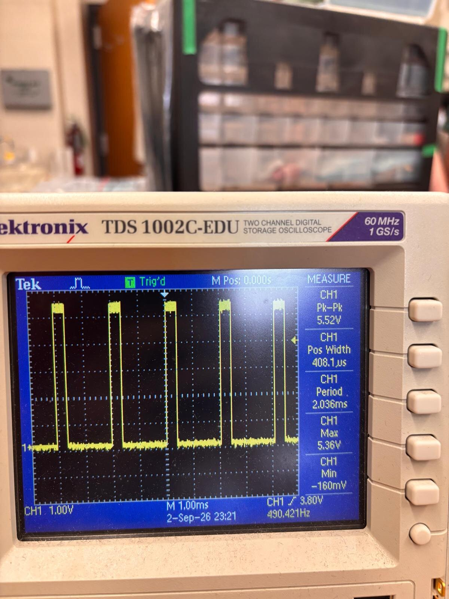
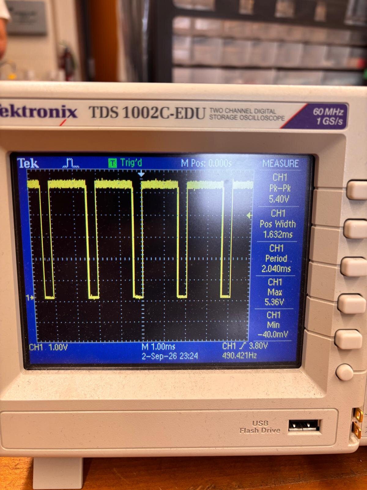
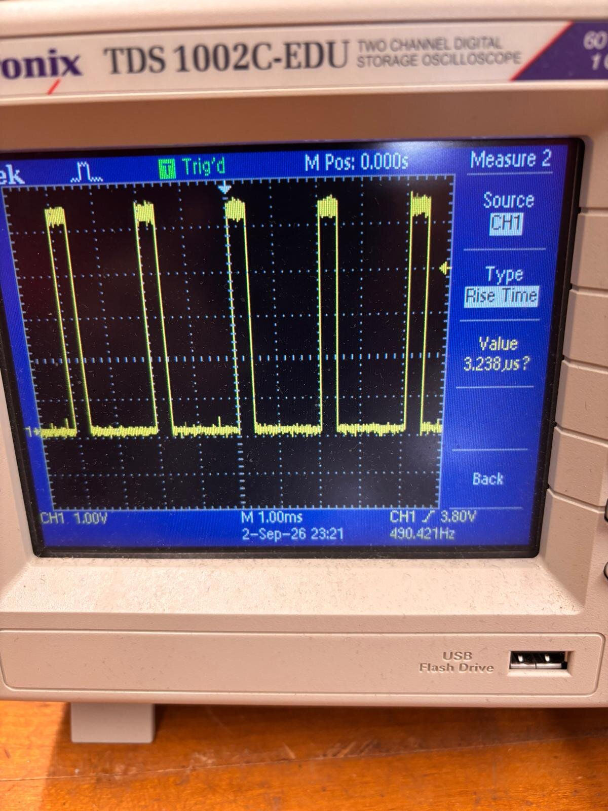

# A1: Module 1 Evidence Note

**Assessment code:** A1
**Team members:** Kapil Naidu and Samuel Cohen
**Date:** September 2, 2026 (data collection), _[submission date]_
**Repository URL:** https://github.com/kapilnaidu1/phys39-naidu-cohen
**Branch:** main
**Pushed Git checkpoint (full commit hash):** `18e2a9b92277676d8acf8c45550674b80ba46250`

This is the commit that carries the complete Module 1 work: all five sketches, the raw Part 3C/3D capture, and this note. The single commit after it does nothing but write this hash into these two lines, since a commit cannot contain its own hash.

---

## 1. Apparatus

### 1.1 Bench instrument

**Figure 1.** The semester temperature-control instrument. Functional blocks:

| Block | Component |
|---|---|
| Sensor | Thermistor |
| Actuator | TEC / Peltier element |
| Controller | Arduino Uno |
| Power stage | H-bridge driver and 12 V / 10 A supply |
| Thermal load | Aluminium heat exchanger |
| Safety cutoff | Bimetallic thermal cutout switch (snap-disc thermostat) bolted to the aluminium plate |

The safety cutoff is the silver disc with two spade terminals visible on the aluminium plate in Figure 1, immediately beside the blue mounting collar. It is wired back through the terminal block so that it sits in series with the TEC supply, and it opens the circuit if the plate temperature exceeds its trip point. The assembly is labelled **TEC 7**.

Per the Module 1 safety boundary, the Arduino was powered only from USB and **the TEC power supply remained off for the entire session.** The 12 V / 10 A supply, the terminal block, the TEC, the heat exchanger, the thermistor and the cutoff were inspected but never energised.

### 1.2 Measurement circuit

**Figure 2.** Breadboard as wired for Parts 2 to 4.

| Arduino | Connection |
|---|---|
| 5V | Potentiometer outer terminal |
| GND | Potentiometer other outer terminal, LED cathode |
| A0 | Potentiometer wiper (centre terminal) |
| Pin 9 | 3.25 kΩ series resistor → LED anode |

Potentiometer: 100 kΩ linear, wired as a voltage divider supplying 0 to 5 V to A0. The 3.25 kΩ series resistor is within the 200 Ω to 4000 Ω range the assignment specifies for current limiting.

---

## 2. Arduino code

All sketches live in [`code/module_01/`](../../code/module_01/).

| Sketch | Purpose | Results it produced |
|---|---|---|
| [`adc_raw.ino`](../../code/module_01/adc_raw.ino) | Prints raw integer ADC values as `ADC:nnn` | §3 min/max/midrange, Figures 3 and 4 |
| [`adc_volts.ino`](../../code/module_01/adc_volts.ino) | Converts counts to volts | §3 resolution check |
| [`averaging_compare.ino`](../../code/module_01/averaging_compare.ino) | Alternating 100×(N=1) and 100×(N=1000) blocks, with `micros()` timing the 1000-read loop | §4 all averaging results and §5 acquisition time; produced `ave_data.txt` |
| [`pwm_brightness.ino`](../../code/module_01/pwm_brightness.ino) | Averaged pot voltage → PWM → LED | §6 PWM measurements |
| [`blink_ratio.ino`](../../code/module_01/blink_ratio.ino) | Blink at three HIGH:LOW ratios | §6 Blink measurements |

Parts 3C and 3D share a single sketch because the timing measurement wraps the same 1000-reading loop that produces the averaged points, so both results come from one run.

Raw numerical output: [`data/module_01/ave_data.txt`](../../data/module_01/ave_data.txt)

---

## 3. ADC digitization (Parts 3A and 3B)

### 3.1 Measured range

| Quantity | ADC count | Voltage |
|---|---|---|
| Minimum | 0 | 0.0000 V |
| Maximum | 1023 | 5.0000 V |
| Midrange setting used | 512 | 2.502444 V |

The potentiometer spanned the full converter range, reaching both rail-limited codes.

### 3.2 One-count voltage resolution

The Uno's ADC is 10-bit, dividing the input span into 2¹⁰ = 1024 levels:

ΔV_ADC = V_ref / 2¹⁰ = 5.00 V / 1024 = 0.004883 V = **4.88 mV**

Voltages were computed in software as V = V_ref × n / 1023, following the form given in the assignment.

### 3.3 Why the readings occupy discrete levels

**Figure 3.** Serial Monitor showing integer output.

**Figure 4.** Serial Plotter at a code boundary, toggling between codes 512 and 513 with no intermediate values.

The potentiometer's wiper voltage is genuinely continuous, so the discreteness is introduced by the converter and not by the signal. A 10-bit ADC produces one of exactly 1024 possible codes, numbered 0 to 1023. It reports which of 1024 equal 4.88 mV windows the input fell into, so every voltage inside a given window returns the identical integer and the information about where inside that window the voltage actually sat is discarded. This quantization error is up to ±½ count, or ±2.44 mV.

Figure 4 makes this visible directly: with the pot held at a code boundary the trace is a two-level square wave and never lands anywhere between the two levels.

### 3.4 Why extra decimal places do not improve resolution

The printed voltage is calculated from the integer, not measured independently. With only 1024 possible codes there are only 1024 possible printed voltages, however many decimals are shown. Code 512 gives 2.502444 V and code 513 gives 2.507331 V; nothing between them can ever appear. The additional digits come from the floating-point division, not from the hardware resolving more finely. Printing 2.502444 implies knowledge to 1 µV while the true single-reading uncertainty is ±2.44 mV. Our own output confirms this: every line of a 100-point unaveraged block read exactly 2.502444 V, with the trailing digits never moving.

---

## 4. Averaging (Part 3C)

### 4.1 Working point

The 3A midrange setting at code 512 produced no dither: every single reading returned the identical code, which makes s₁ = 0 and the ratio undefined. That behaviour is documented in §4.5 as a separate observation.

For the quantitative comparison the potentiometer was moved to a setting that sits on a **code boundary**, where the single readings alternate between codes 863 and 864:

- code 863 → 4.217986 V
- code 864 → 4.222874 V
- separation 4.888 mV, exactly one ADC count

All results in §4.2 to §4.4 come from one complete cycle at this fixed setting: 100 single readings followed immediately by 100 thousand-reading averages.

### 4.2 Plots

**Figure 5.** Serial Plotter with the transition near the centre of the graph. The unaveraged block on the left shows full-height 4.888 mV excursions between codes 863 and 864; the 1000-reading averaged block on the right is nearly flat on the same vertical scale.

**Figure 6.** Unaveraged block alone. Two discrete levels at 4.217986 V and 4.222874 V and nothing between them. The smallest discrete jump is one full ADC count.

**Figure 7.** A 1000-reading averaged block alone, with the vertical axis spanning only 7 µV. Every step is a whole multiple of 4.888 µV, one ADC count divided by 1000. Note that this capture is from the **code-512 working point** rather than the code-863/864 point used for the table, because that is where the averaged block was flat enough for the plotter to autoscale down to a few microvolts and make the individual 4.888 µV steps visible. The quantitative discussion of that dataset is in §4.5.

### 4.3 Discrete voltage jumps (part b)

| Block | Smallest nonzero jump between successive points | Comparison |
|---|---|---|
| Unaveraged (N = 1) | **4.888 mV** | ΔV_ADC = 4.883 mV, agreement to 0.1% |
| Averaged (N = 1000) | **0.0049 mV** (4.9 µV) | ΔV_ADC / 1000 |

The unaveraged smallest jump equals the ADC's fixed one-count digitization step exactly, as it must: a single conversion can only move by whole codes. The averaged block resolves steps a thousand times finer, because the mean of 1000 integers shifts by 1/1000 of a count whenever one reading changes code.

Two small notes. The 0.1% residual between 4.888 mV and ΔV_ADC = 4.883 mV is purely the difference in convention: the sketch converts with V = V_ref n/1023 while ΔV_ADC is defined as V_ref/2¹⁰. And the averaged jump is quoted as 4.9 µV rather than 4.888 µV because the sketch prints six decimal places, giving a 1 µV display quantum; the underlying step is 4.888 µV.

**The factor of 1000 here is arithmetic, not noise reduction.** It says the averaged result can *represent* values a thousand times finer than one count. How much precision was actually gained is a separate question, answered in §4.4, and the answer is a factor of about 28, not 1000.

### 4.4 Averaging table (part a)

**This is the required table.**

| Potentiometer block | Reported points | Readings averaged per point N | Mean voltage | Sample standard deviation s | s/s₁ measured | s/s₁ predicted |
|---|---|---|---|---|---|---|
| Unaveraged | 100 | 1 | 4.221799 V | **2.035 mV** | 1.000 | 1.000 |
| Long average | 100 | 1000 | 4.222477 V | **0.0726 mV** | **0.0357** | 0.0316 |

**Measured 0.0357 against a prediction of 0.0316: 13% high.** Averaging 1000 readings reduced the noise-limited voltage resolution by a factor of 28 where the independent-noise model predicts 31.6.

**How s₁ arises.** The unaveraged block contained 78 readings at code 864 and 22 at code 863. For a two-level toggle with fraction p on the upper code, s₁ = ΔV × √(p(1−p)) = 4.888 mV × √(0.78 × 0.22) = 2.02 mV, against the 2.035 mV computed directly from the 100 values. The single-reading fluctuation is therefore entirely accounted for by the code toggling, with no additional noise source needed.

**Effective bits gained.** The ideal figure is

b_gained = ½ log₂(1000) = **4.98 bits**

and the measured figure is

b_gained = log₂(s₁/s₁₀₀₀) = log₂(2.035 / 0.0726) = **4.81 bits**

so the averaging delivered about 4.8 of the ideal 5.0 effective bits.

**Why the measured ratio sits above the prediction.** Three effects are visible in this dataset.

The clearest is **drift**. The two blocks were taken about five seconds apart, and their means differ by 4.222477 − 4.221799 = **0.68 mV**, which is 0.14 of an ADC count. That shift is far larger than s₁₀₀₀ = 0.073 mV, so the input was demonstrably not constant across the measurement. Any drift within the averaged block inflates s₁₀₀₀ without being noise that averaging can remove.

**Correlated pickup** contributes as well. The 1/√N law assumes independent fluctuations, but consecutive `analogRead()` calls inside the averaging loop are only about 112 µs apart, so 1000 of them span 0.112 s and sample only about seven cycles of 60 Hz mains hum. Any hum component is therefore heavily correlated within a single average rather than random, and averages down more slowly than √N.

**Quantization** is a smaller effect here but not absent: even at a code boundary the dither is a two-level Bernoulli process rather than continuous Gaussian noise, and the 78/22 split is not the 50/50 that would maximise the dither.

Given all three, agreement within 13% is good, and it is the sign one expects: real departures make averaging *less* effective than the ideal, never more.

**Precision is not accuracy.** Averaging made the reported value more repeatable, not more correct. If the true reference is 4.93 V rather than 5.00 V, every averaged voltage is systematically high by 1.4% and no amount of averaging detects it. Calibration errors survive averaging untouched.

### 4.5 The quantization limit, observed directly

Earlier in the session the potentiometer sat at code 512 (2.502444 V), comfortably inside a code window rather than on a boundary. There, **all 100 unaveraged readings returned the identical value**, giving s₁ = 0 exactly and making the ratio undefined.

The averaged block at that setting still varied, with s₁₀₀₀ = 3.3 µV, and its 100 values took only four distinct levels spaced by 4.888 µV: 62 at the top level, 32 one step down, 4 two steps down and 2 three steps down. Treating the count of low-code readings per group of 1000 as binomial gives p ≈ 4.6 × 10⁻⁴ from the mean and p ≈ 4.5 × 10⁻⁴ from the variance, agreeing to 1.5%. Roughly one reading in 2200 flipped code, so a 100-point unaveraged block would be expected to contain 0.046 flips, and observing none is exactly what that predicts.

This is the precondition the assignment names, failing in front of us: averaging adds effective bits **only** when independent noise causes the readings to sample neighbouring ADC codes. With fluctuations below one 4.888 mV step the converter is deterministic, the unaveraged block carries no information about the noise at all, and the 1/√N comparison cannot even be attempted. Moving the potentiometer onto a code boundary, which is the measurement reported in §4.4, is what made the comparison possible.

### 4.6 Reference voltage

One further departure applies to both settings and is not visible in either standard deviation. The Uno's 5 V rail is derived from USB and moves with load and ambient temperature. Every computed voltage is scaled by V_ref, so a shift in the reference moves all readings together. Averaging cannot detect it, and part of the 0.68 mV offset between the two block means in §4.4 may be rail drift rather than potentiometer drift; the two cannot be separated with this measurement alone.

---

## 5. Time cost of averaging (Part 3D)

Timing was measured with `micros()` immediately before and after the 1000-reading acquisition loop, with no `Serial` output inside the timed region. Eleven consecutive cycles were recorded.

| Quantity | Measured | Reference |
|---|---|---|
| Elapsed time for 1000 `analogRead()` | **112,042 µs = 0.112 s** | ≈ 100,000 µs |
| Time per conversion | **112.0 µs** | ≈ 100 µs |
| Conversion rate | **8,925 per second** | ≈ 10,000 per second |

Individual readings spanned 112,000 to 112,104 µs, a spread of 0.1%, so the measurement is highly repeatable. The result sits 12% above the Arduino reference figure of "roughly 100 µs per conversion," which is consistent with that being an approximate value: the ATmega328P ADC takes 13 clock cycles per conversion at a 125 kHz ADC clock, giving 104 µs, and the remaining few microseconds are the function-call and loop overhead of `analogRead()` itself.

**The tradeoff.** One averaged point costs 0.112 s of acquisition, so the sketch can report fewer than nine averaged values per second. Any change in the input occurring during that window is folded into the mean rather than resolved. Averaging over a finite interval is therefore a low-pass filter: fluctuations faster than roughly 9 Hz are attenuated, which is exactly what suppresses the noise, but a genuine fast transient would be flattened and delayed by the same mechanism. Improved voltage precision is bought directly with reduced time resolution, and the two cannot be optimised independently.

Our own data shows both sides of this. Averaging bought a factor of 28 in voltage precision (§4.4), and the 0.68 mV drift between the two blocks is precisely the kind of slow change that a 0.112 s averaging window passes straight through rather than suppressing.

---

## 6. Oscilloscope measurements

Instrument: Tektronix TDS 1002C-EDU, 60 MHz, 1 GS/s. Probe 10X, scope channel set to 10X, DC coupling, ground clip on Arduino GND, probe tip on the measured pin.

### 6.1 Blink digital output (Part 1)

Blink was run with both the built-in LED and an external LED on pin 9 through the 3.25 kΩ series resistor, using [`blink_ratio.ino`](../../code/module_01/blink_ratio.ino) at HIGH:LOW ratios of 1:1, 10:1 and 1:10. The total period was held at 1000 ms in each case so that only the ratio changed.

**The instructor confirmed that this part was a short familiarisation exercise and that no oscilloscope data needed to be recorded for it, so no Blink measurements are reported here.** The dimensional oscilloscope measurements in this note are the PWM measurements of §6.2.

For reference, the expected values had they been measured are a period of 1.00 s and a frequency of 1.00 Hz in all three cases, with duty cycles of 50.0%, 90.9% and 9.1% respectively, and high and low levels near 5 V and 0 V.

### 6.2 LED PWM (Part 4)

**Figure 8.** PWM output on pin 9 at 20.0% duty cycle. 1.00 V/div, 1.00 ms/div.

**Figure 9.** The same pin at 80.0% duty cycle. Identical amplitude and period.

| Quantity | Setting A | Setting B | Behaviour |
|---|---|---|---|
| Maximum | 5.36 V | 5.44 V | fixed |
| Minimum | −0.200 V | −0.120 V | fixed |
| Amplitude (peak to peak) | 5.56 V | 5.56 V | fixed |
| Period T | 2.040 ms | 2.036 ms | fixed |
| Frequency f = 1/T | 490.42 Hz | 491.2 Hz | fixed |
| Positive pulse width t_HIGH | 408.1 µs | 1.628 ms | **changes** |
| Duty cycle D = 100% × t_HIGH/T | **20.0%** | **80.0%** | **changes** |

**Which quantities change.** Only the positive pulse width and the duty cycle respond to the potentiometer. The high and low voltages, the amplitude, the period and the frequency all hold constant within measurement scatter. This is the defining property of pulse-width modulation: the pin switches fully on or fully off and nothing else, so the only free parameter is the fraction of each cycle spent high.

**Frequency comparison.** Measured 490.42 Hz against the expected 490 Hz for Uno pin 9. Pin 9 is driven by Timer1 with a prescaler of 64 in phase-correct mode, counting to 255 and back down, giving 16,000,000 / 64 / 510 = 490.196 Hz. Our measurement agrees to 0.05%.

**Expected duty cycle.** D_expected = 100% × (analogWrite value / 255). Setting A corresponds to an analogWrite value of about 51 and Setting B to about 204.

**Overshoot.** Maximum reads 5.36 to 5.44 V and Minimum reads −0.12 to −0.20 V rather than a clean 5.00 V and 0 V. This is ringing on the fast switching edges captured by the peak detectors, not a supply anomaly. The flat portions of the trace sit at the expected levels.

**Figure 10.** Rise-time measurement on the same PWM waveform: **3.238 µs**. The edge is fast but not instantaneous, and its shape is set by the ATmega328P output driver and the probe loading rather than by anything in the sketch.

### 6.3 Why the LED appears continuously lit

Human flicker fusion occurs somewhere in the range of roughly 50 to 60 Hz for ordinary viewing conditions. Our measured PWM frequency of 490 Hz is eight to ten times above that, so the eye integrates over many complete cycles and perceives only the time-averaged brightness. The LED is in fact switching fully on and fully off 490 times per second the whole time, which the oscilloscope resolves without difficulty.

The fusion threshold is not a single universal frequency. It rises with luminance, so a bright source needs a higher frequency to appear steady than a dim one. It also depends on contrast, on the fraction of the visual field the source occupies, and on whether the source is viewed foveally or peripherally, since peripheral vision is more sensitive to temporal change. This is why a display that appears steady when looked at directly can appear to flicker in the corner of the eye.

### 6.4 What the oscilloscope revealed that the serial displays did not

- The oscilloscope makes a **direct electrical measurement of the voltage on the wire**, sampling at 1 GS/s. Serial Monitor and Serial Plotter show numbers the sketch chose to compute and print, at roughly 10 to 50 lines per second. They are a report about the signal, not the signal.

- **The serial displays cannot see a 490 Hz waveform at all.** Their reporting rate is one to two orders of magnitude below the PWM frequency, so the switching is invisible to them by construction. The scope resolved individual pulses, their rising and falling edges, and the 408 µs high time directly.

- The scope exposed features that exist **nowhere in the software**. The overshoot to 5.36 V and undershoot to −0.2 V on the switching edges are one example. Another is the edge transition itself: a separate rise-time measurement on the same waveform gave **3.238 µs**, a quantity the sketch neither computes nor could compute, since `analogWrite` only sets a compare register and the edge shape is a property of the output driver and the probe loading. No printed value could reveal any of this. Conversely the serial displays showed the exact integers behind the conversion, which the scope cannot see. The two instruments answer different questions and neither substitutes for the other.

---

## 7. Pushed Git checkpoint

- Repository: https://github.com/kapilnaidu1/phys39-naidu-cohen
- Branch: main
- Full commit hash: `18e2a9b92277676d8acf8c45550674b80ba46250`
- Commit message: Add Part 3C/3D raw data and finish evidence note

That commit carries everything the note cites: the five sketches under `code/module_01/`, the raw capture in `data/module_01/ave_data.txt`, and this document. Only one commit follows it, and its sole content is writing this hash into the two places it appears, since a commit cannot contain its own hash.
