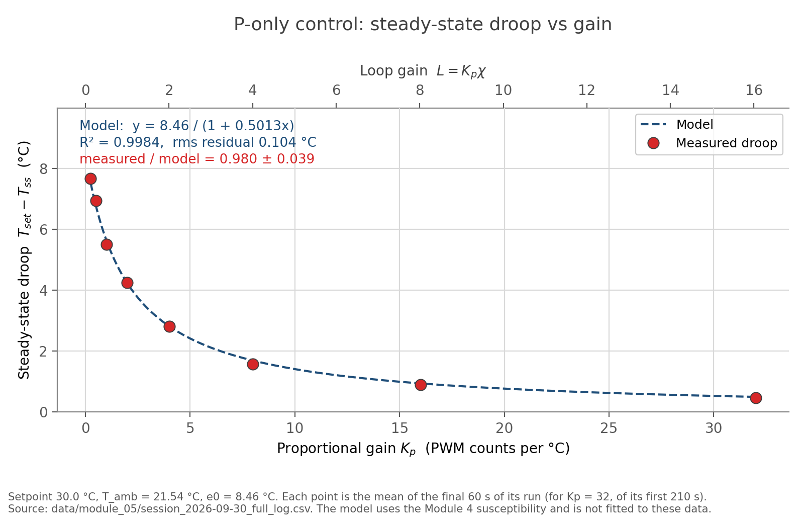

# Module 5: P-only temperature control

Naidu / Cohen, 30 September 2026. Evidence for A3 and C4. No separate paper.

**Code.** [`python/tec_p_control_gui.py`](../../python/tec_p_control_gui.py) (controller),
[`arduino/module_04/tec_open_loop_safety`](../../arduino/module_04/tec_open_loop_safety/tec_open_loop_safety.ino) (unchanged; keeps the 60 C software limit),
[`python/plot_droop.py`](../../python/plot_droop.py) (figure).
Data in `data/module_05/`, figure in `docs/figures/module_05/`.

**From Module 4:** &chi;<sub>T,h</sub> = 0.50127 &deg;C/count,
&#124;&chi;<sub>T,c</sub>&#124; = 0.18091, T<sub>amb</sub> = 21.54 &deg;C,
&tau; = 62.9 &plusmn; 5.0 s, noise floor 0.16 &deg;C p-p.

The time constant is the one fitted in Module 6 Part 3
([`python/estimate_tau.py`](../../python/estimate_tau.py)) from the eight
constant-command steps in `data/module_04/full_run.csv`. The 70 s used at the
bench to decide how long to wait was a working estimate; every &tau;<sub>cl</sub>
below uses the fitted value.

---

## Before class

| Item | Status |
|---|---|
| Module 4 susceptibility identified near room temperature | &chi;<sub>T,h</sub> = 0.50127, &#124;&chi;<sub>T,c</sub>&#124; = 0.18091 &deg;C/count |
| Arduino safety shutdown still works | **Re-tested and passed, 5 October 2026.** Software limit lowered to about 30 &deg;C, plate warmed past it, latch tripped and both PWM outputs went to zero; limit then restored to 60 &deg;C. Same method as the Module 4 Part 1 check. Team test, not witnessed by the instructor this time, so Module 4's witnessed trip remains the stronger record. |
| Setpoint chosen, e<sub>0</sub> calculated | 30.0 &deg;C, e<sub>0</sub> = 30.0 &minus; 21.54 = 8.46 &deg;C |
| Sign convention recorded | positive u heats, negative u cools, Arduino receives P = &#124;u&#124; |

---

## Pre-class questions

**1. T<sub>set</sub> = 30, T = 25: heat or cool?** Heat. e = +5 &deg;C so
u = K<sub>p</sub>e > 0, and positive u selects heating.

**2. Units of K<sub>p</sub>?** PWM counts per &deg;C. That is why a bare
K<sub>p</sub> cannot be called large or small; the dimensionless combination
is L = K<sub>p</sub>&chi;.

**3. Why does P control need a nonzero error?** Because the output *is* the
error times a constant. At the setpoint it commands nothing, but a lump above
room temperature keeps losing heat, so something must supply a steady
counter-flow. The standing error is the loop's only means of asking for it.

**4. Symptoms of K<sub>p</sub> too large?** Overshoot then undershoot;
sustained oscillation; PWM slamming between large heat and cool values or
saturating; chasing measurement noise. The one-lump model is first order and
cannot oscillate, so oscillation would indicate lag, a second mass, sampling,
or saturation.

---

## 1. Controller

Control law, one update per measurement (**1.97 Hz measured**, set by the
Arduino's 500-sample average and its 500 ms reporting interval):

```python
e = self.setpoint - temperature_c
u = self.kp * e
heating = u >= 0.0
p = max(0, min(255, int(round(abs(u)))))
```

**Deviation worth stating.** Part 1 asks for an average of *about 1000* raw
thermistor readings. `sampleCount` was reduced from 1000 to 500 on the morning
of 30 September, before any Module 5 data was taken, so **every run in this
note averages 500**. That is inside the 100 to 1000 band Module 6 Part 3 states
for Modules 2 to 5, but it is half what Modules 4 and 5 ask for. The effect is
a factor &radic;2 in the noise on a single reading, which is consistent with
the 0.16 &deg;C floor used throughout. Restore 1000 before the next run.

Reporting is at 2 Hz rather than 1, which the module permits: it warns only
about being slower than once a second.

The GUI plots all five quantities Part 1 lists: temperature, the setpoint as a
line on the same axes, error on its own axes, PWM magnitude, and direction as
the red/blue colouring of the PWM trace.

Python decides what to ask for; the Arduino decides what to do. The Module 4
software limit is unreachable from the GUI, so a runaway gain can oscillate or
saturate the loop but cannot defeat the interlock. If the sketch latches, the
GUI sees `SAFETY SHUTDOWN` and switches P control off.

---

## 2. Sign test, K<sub>p</sub> = 0.25

| Setpoint | Expected | Result |
|---|---|---|
| 30 &deg;C | positive error &rarr; heating | **PASS**, 3064 samples, all HEAT |
| 15 &deg;C | negative error &rarr; cooling | **PASS**, 394 samples, all COOL |

One sample at the setpoint change reports a negative error with HEAT: the
Arduino echoing the previous command before its next report. One sample of
pipeline delay, not a sign error.

**The same K<sub>p</sub> gives L = 0.125 heating but 0.045 cooling**, 2.77x
weaker, because &chi;<sub>T,c</sub> is that much smaller. The Module 4
asymmetry propagates straight into the feedback.

Data: `sign_test_and_sweep.csv`.

---

## 3. Droop versus gain

Setpoint 30.0 &deg;C, e<sub>0</sub> = 8.46 &deg;C,
P<sub>required</sub> = 8.46/0.50127 = **16.9 counts** open-loop.

Gains chosen so P<sub>0</sub> = K<sub>p</sub>e<sub>0</sub> starts far below
P<sub>required</sub> and ends well above, with L spanning both sides of 1 and
nothing starting clamped.

Steady state: drift over the final 60 s no larger than the 0.16 &deg;C noise
floor. T<sub>ss</sub> is the mean of that minute.

Setpoint 30.0 &deg;C for every row. Predicted
P<sub>0</sub> = K<sub>p</sub>e<sub>0</sub> is what the gain would ask for
starting from ambient.

| K<sub>p</sub> | pred. P<sub>0</sub> | P<sub>0</sub>/P<sub>req</sub> | L | T<sub>ss</sub> | pred. T<sub>ss</sub> | droop | pred. droop | ratio | final PWM | K<sub>p</sub>&times;droop |
|---|---|---|---|---|---|---|---|---|---|---|
| 0.25 | 2.1 | 0.13 | 0.125 | 22.34 | 22.48 | 7.66 | 7.52 | 1.019 | 2 | 1.9 |
| 0.50 | 4.2 | 0.25 | 0.251 | 23.06 | 23.24 | 6.94 | 6.76 | 1.026 | 3 | 3.5 |
| 1.00 | 8.5 | 0.50 | 0.501 | 24.50 | 24.36 | 5.50 | 5.64 | 0.976 | 6 | 5.5 |
| **2.00** | **16.9** | **1.00** | **1.003** | **25.75** | **25.78** | **4.25** | **4.22** | **1.006** | 8 | 8.5 |
| 4.00 | 33.8 | 2.00 | 2.005 | 27.18 | 27.18 | 2.82 | 2.82 | 1.002 | 11 | 11.3 |
| 8.00 | 67.7 | 4.00 | 4.010 | 28.33 | 28.31 | 1.67 | 1.69 | 0.989 | 13 | 13.4 |
| 16.00 | 135.4 | 8.01 | 8.020 | 29.10 | 29.06 | 0.90 | 0.94 | 0.960 | 27 | 14.4 |
| 32.00 | 270.7 | 16.02 | 16.041 | 29.54 | 29.50 | 0.46 | 0.50 | 0.927 | 31 | 14.7 |

**The range does what Part 3 asks.** P<sub>0</sub> starts at 0.13 of
P<sub>required</sub> and ends at 16 times it, crossing 1 exactly at
K<sub>p</sub> = 2 where L = 1. Only the top row would start outside 0 to 255,
and it did not, because each gain was entered from the previous steady state
rather than from ambient: at K<sub>p</sub> = 32 the run began 0.91 &deg;C from
setpoint and asked for 29 counts, not 271. That is a deliberate consequence of
sweeping rather than restarting, and it is why saturation was never reached.

**Mean ratio 1.003, sd 0.017, worst point 2.6% off**, over a 32-fold range of
gain. The prediction used the Module 4 susceptibility and was not fitted.

**At L = 1.003 the droop is 4.25 &deg;C of an 8.46 &deg;C error: 50.2%
surviving against 50% predicted.**

**The last column is a self-consistency check, not an independent one.**
Earlier drafts of this note called it independent evidence. It is not: the
controller computes `p = round(abs(kp * e))`, so PWM = K<sub>p</sub>&times;droop
is an identity that holds at every instant whether or not the loop has settled,
and it cannot fail. What it does verify is that the command, the error and the
logging agree, which is worth confirming and is all it confirms.

It is still useful for showing the mechanism. That product climbs 1.9 &rarr;
13.4 toward P<sub>required</sub> = 16.9: the loop always converges on roughly
the same command, and gain only changes how much error it needs in order to ask
for it. That part is a statement about the apparatus.

Traces: `kp_0p25_run.csv` (low gain), `kp_sweep_full_run.csv` (whole sweep).

---

## 4. Predicted versus measured

```
T = T_amb + chi*P,   P = Kp(T_set - T)
  =>  T_set - T = (T_set - T_amb)/(1 + chi*Kp)
  =>  fractional droop = 1/(1 + L)
```

chi*Kp is dimensionless: (&deg;C/count)(count/&deg;C) = 1.



Regenerate with `python3 python/plot_droop.py`. The residuals change sign
across the range rather than trending, so there is no systematic bias. Scatter
is comparable to the noise floor divided by the droop: 2% at the largest
droop, 18% at the smallest.

---

## 5. High gain

| K<sub>p</sub> | L | Settles? | mean T | predicted | Amplitude | Period | Frequency | Overshoot | Saturation? |
|---|---|---|---|---|---|---|---|---|---|
| 8.00 | 4.01 | yes | 28.33 | 28.31 | none | n/a | n/a | none | no |
| 16.00 | 8.02 | yes | 29.10 | 29.06 | none | n/a | n/a | none | no, PWM peaked at 27 |
| 32.00 | 16.04 | yes | 29.54 | 29.50 | none | n/a | n/a | 0.041 &deg;C at t = 7 s | no, PWM peaked at 31 |

Period and frequency are not applicable: there was no sustained oscillation at
any gain to measure them on.

**No sustained oscillation and no saturation at the highest gain tested.** Each
run held at least 16 closed-loop time constants, final-60 s spread 0.020
&deg;C, and **zero direction reversals** across all three: the command never
flipped from heating to cooling. Amplitude is defined as half the peak-to-peak
excursion of the settled response; there was none to measure.

**A single small overshoot did appear at K<sub>p</sub> = 32.** The trace peaks
at 29.58 &deg;C about 7 s in and settles at 29.539, so the overshoot is 0.041
&deg;C against a 0.020 &deg;C noise floor: a factor of two above the noise, and
absent at every lower gain. See
[`docs/figures/module_05/p_control_traces.png`](../figures/module_05/p_control_traces.png).
This matters because the one-lump model **forbids** overshoot at any gain: its
single eigenvalue is real and negative, so the deviation keeps its sign.
Observing one is therefore evidence that the model is missing a state, most
plausibly thermal lag between the TEC face and the thermistor, which only
becomes visible once &tau;<sub>cl</sub> = &tau;/(1+L) = 3.7 s is short enough
to approach it. It is small enough that it may also be a sampling artefact at
1 Hz, and distinguishing the two needs a faster log than this one.

**Saturation was not reached.** Each gain was entered from the previous steady
state, so the steps were small. At K<sub>p</sub> = 32 the run began 0.91 &deg;C
from setpoint and asked for 29 counts. From ambient it would ask for 271,
clamping at 255 until the error fell below 7.97 &deg;C. That is a different
experiment, since the loop is nonlinear while clamped and 1/(1+L) does not
apply. Identified for a supervised opportunity, not claimed as done.

**How high gain differs from low:** mostly in speed and offset.
&tau;<sub>cl</sub> = &tau;/(1+L) falls from 55.9 s at K<sub>p</sub> = 0.25 to
7.0 s at K<sub>p</sub> = 16 and 3.7 s at K<sub>p</sub> = 32, while droop falls from
7.66 to 0.46 &deg;C. Up to K<sub>p</sub> = 16 the shape is also unchanged, a
monotonic approach, so the one-lump model is adequate there. The shape first
departs from it at K<sub>p</sub> = 32, where the overshoot above appears, which
puts the thermal lag somewhere between 4 and 7 s.

Figure: `docs/figures/module_05/p_control_traces.png`, built by
`python/plot_p_control_traces.py` from `kp32_high_gain_run.csv`.
Raw traces: `kp_0p25_run.csv`, `kp16_high_gain_run.csv`, `kp32_high_gain_run.csv`.

### Feedback suppresses the temperature noise

Peak-to-peak temperature over the final 60 s was **0.02 to 0.05 &deg;C at every
gain**, against **0.16 &deg;C** measured open-loop at rest.

This is the same 1/(1+L) acting on a different input: the factor that leaves a
fraction of the setpoint error behind also leaves only that fraction of any
slow disturbance. **Droop and disturbance rejection are two faces of one
number**, and the offset cannot be reduced without also quieting the output.

It explains a forecast that missed usefully. Command jitter at K<sub>p</sub> =
16 was predicted as K<sub>p</sub>&times;0.16 = 2.6 counts and measured 0.49,
because the prediction used the open-loop noise when the loop had already
suppressed the fluctuation the controller sees. At K<sub>p</sub> = 32 the
3-count command spread is about one ADC count, so the loop is
quantization-limited rather than noise-limited.

### Not attempted

**K<sub>p</sub> = 400**, used on another bench. L = 200, the command clamps
until the error is within 255/400 = 0.64 &deg;C, and inside that band one ADC
count (0.079 &deg;C) swings the command 32 counts while noise swings it 64.
No proportional region remains: it is a relay controller. Since the plate slews
~1.8 &deg;C/s at full drive and the loop samples once a second, it cannot stop
inside a 0.64 &deg;C band, so a limit cycle follows. Outside the range
justified above, and it repeatedly reverses several amps through the Peltier.

---

## 6. Interpretation

### One-lump model

```
C dT/dt = Pu*Kp*(T_set - T) - H*(T - T_amb)
```

**(1) Why the lump cannot stay at a non-ambient setpoint.** At T = T<sub>set</sub>
the commanded TEC flow is zero but H(T<sub>set</sub>&minus;T<sub>amb</sub>) is
not, so the lump drifts toward ambient, the error grows, and the controller
responds. Setting dT/dt = 0:

```
Pu*Kp*(T_set - T) = H*(T - T_amb)
T_set - T = (T_set - T_amb)/(1 + Pu*Kp/H)
```

which is the Part 4 result with **&chi;<sub>T,u</sub> = P<sub>u</sub>/H**. The
two agree provided P<sub>u</sub> and H are constant over the range, the lump is
at one uniform temperature, and there is no saturation.

**(2) &chi; = P<sub>u</sub>/H, with units.** Open the loop: at steady state
0 = P<sub>u</sub>u &minus; H(T&minus;T<sub>amb</sub>), so &chi; = dT/du =
P<sub>u</sub>/H, equivalently **P<sub>u</sub> = H&chi;<sub>T,u</sub>**. Units
(W/count)/(W/K) = K/count.

*Relating this to the Module 4 slopes.* For heating the Arduino receives
u = P &gt; 0, so &chi;<sub>T,h</sub> = dT/dP = P<sub>u</sub>/H. For cooling it
still receives the positive magnitude P = &minus;u, so dT/dP =
&minus;P<sub>u</sub>/H and the cooling magnitude is
&#124;&chi;<sub>T,c</sub>&#124; = P<sub>u</sub>/H. **The one-lump model with a
single P<sub>u</sub> therefore predicts the two magnitudes to be equal.** Ours
are 0.50127 and 0.18091, a factor of 2.77 apart. That is not a failure of the
algebra, it is Module 4's result arriving here: Peltier transport reverses with
the current and Joule heating does not, so the two add when heating and oppose
when cooling. A single P<sub>u</sub> is only valid within one direction, and
every droop prediction below uses the heating value because every run sits
above ambient.

- P<sub>u</sub> doubles &rarr; &chi; doubles
- H doubles &rarr; &chi; halves
- **C doubles &rarr; &chi; unchanged.** C does not appear in the steady-state
  ratio; it multiplies dT/dt, so it sets how long the approach takes
  (&tau;<sub>cl</sub> = C/(H + P<sub>u</sub>K<sub>p</sub>)) and nothing about
  where it ends. Thermal capacity is a transient property.

**(3) L and 1/(1+L).**

| K<sub>p</sub> | L | measured fraction | 1/(1+L) | ratio |
|---|---|---|---|---|
| 0.25 | 0.125 | 0.905 | 0.889 | 1.019 |
| 0.50 | 0.251 | 0.820 | 0.800 | 1.026 |
| 1.00 | 0.501 | 0.650 | 0.666 | 0.976 |
| 2.00 | 1.003 | 0.502 | 0.499 | 1.006 |
| 4.00 | 2.005 | 0.333 | 0.333 | 1.002 |
| 8.00 | 4.010 | 0.197 | 0.200 | 0.989 |
| 16.00 | 8.020 | 0.107 | 0.111 | 0.964 |

**Only K<sub>p</sub> = 0.25 and 0.50 genuinely have small gain**, L < 0.3, with
over 80% of the error surviving. K<sub>p</sub> = 1 and 2 are comparable; from 4
upward the feedback is strong and the fraction approaches 1/L. The
classification cannot be made from K<sub>p</sub> alone: K<sub>p</sub> = 2 is
comparable heating but weak cooling, where the same gain gives L = 0.36.

*Where the remaining 2 to 3% comes from.* The ratios scatter between 0.964 and
1.026 with no trend in L, so this is noise rather than a missing term. The
steady-state criterion itself accounts for most of it: a point is accepted once
its drift over the final minute is no larger than the 0.16 &deg;C noise floor,
and 0.16/8.46 = **1.9% of e<sub>0</sub>**, against an observed standard
deviation of 1.7% and a worst case of 2.6%. The rest is room drift over a
two-hour session moving T<sub>amb</sub>, and a single &chi; fitted across the
whole heating branch while each run settles at a different point on it.

### First-order expectation

&theta; = T &minus; T<sub>ss</sub> obeys &theta;(t) = &theta;(0)e<sup>&minus;t/&tau;<sub>cl</sub></sup>
with &tau;<sub>cl</sub> = C/(H + P<sub>u</sub>K<sub>p</sub>). This decays
monotonically and **cannot oscillate at any gain**, and &tau;<sub>cl</sub>
falls as K<sub>p</sub> rises, so higher gain should settle both closer and
faster. Both were observed.

No sustained oscillation appeared at any gain. **A single 0.041 &deg;C
overshoot did appear at K<sub>p</sub> = 32** (section 5), which this model
forbids outright: one state variable gives one real negative eigenvalue, so
&theta; keeps its sign while shrinking and the trace cannot cross
T<sub>ss</sub> at all. Something is therefore missing from the one-lump
picture, and it is the model rather than the control law that is at fault.
Candidates: thermal lag between the TEC face and the thermistor, a second
thermal mass, 1 Hz sampling against &tau;<sub>cl</sub> = 3.7 s at that gain,
noise amplified by gain, or saturation making the loop nonlinear. Saturation is
ruled out, since the command peaked at 31 of 255 counts. The rest is worked
through in
[`module_06_pi_modeling.md`](module_06_pi_modeling.md) section 6.

---

## 7. Evidence for A3 and C4

- [x] sign test, both directions: Part 2
- [x] gain range and its justification: Part 3
- [x] dimensional droop table: Part 3
- [x] high-gain response table: Part 5
- [x] measured and predicted droop on one graph:
  `docs/figures/module_05/droop_vs_gain.png`
- [x] Part 4 to Part 6 derivation: Part 6
- [x] low- and high-gain strip-chart traces:
  `docs/figures/module_05/p_control_traces.png`, from `kp32_high_gain_run.csv`
- [x] filenames of controller, sketch and data: top of this note
- [x] explanation of droop and the oscillation result: Parts 3, 5, 6

**Open:** instructor approval of the gain range was obtained retrospectively,
and saturation was never reached, so the clamped regime is untested. Both are
carried into Module 6, where the K<sub>p</sub> = 32 overshoot is also the
natural case for the "what is the model missing" discussion.
